<p align="center"><i>fig. Simple network with DNS and FTP server</i></p>

<p>We should use copper cross-over cable(dotted lines) to connect from router to router and copper straight-through cable(smooth line) to connect from router to switch and switch to end devices.</p>

<p>Here we are assuming the ip addresses as given in the figure above.</p>

# IP configuration:
We are configuring all the static ip. An example for PC0 is given in the figure below.

**PC0**<br>
IP address: `192.168.1.2` <br>
Subnet Mask: `255.255.255.0` <br>
Default Gateway: `192.168.1.1` <br>
DNS Server: `192.168.5.4`

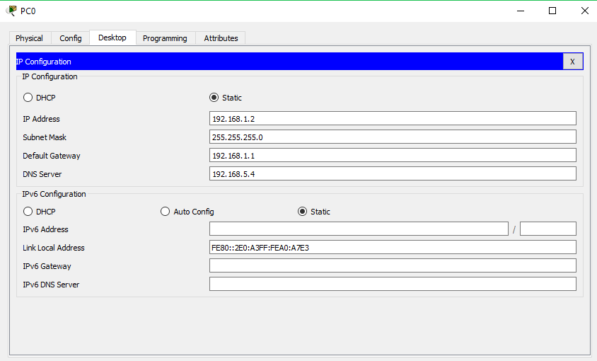
<p align="center"><i>fig. IP configuration for PC0</i></p>

In the same way, you can configure IP of all end devices as:

**PC1**<br>
IP address: `192.168.1.3` <br>
Subnet Mask: `255.255.255.0` <br>
Default Gateway: `192.168.1.1` <br>
DNS Server: `192.168.5.4`

**PC2**<br>
IP address: `192.168.5.2` <br>
Subnet Mask: `255.255.255.0` <br>
Default Gateway: `192.168.5.1` <br>
DNS Server: `192.168.5.4`

**Web and FTP server**<br>
IP address: `192.168.5.3` <br>
Subnet Mask: `255.255.255.0` <br>
Default Gateway: `192.168.5.1` <br>

**DNS Server**<br>
IP address: `192.168.5.4` <br>
Subnet Mask: `255.255.255.0` <br>
Default Gateway: `192.168.5.1` <br>

<p>Make sure that we have not write DNS server to the Web, FTP and DNS server.</p>

# For Router

**Router0 To Switch0**<br>
Ip address: `192.168.1.1` <br>
Subnet Mask: `255.255.255.0`<br>
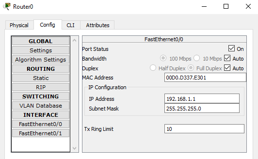
*fig. An example figure for IP configuration of Router0 To Switch0*

**Router0 To Router1**<br>
Ip address: `192.168.50.1` <br>
Subnet Mask: `255.255.255.0`

**Router1 To Switch1**<br>
Ip address: `192.168.5.1` <br>
Subnet Mask: `255.255.255.0`

**Router1 To Router0**<br>
Ip address: `192.168.50.2` <br>
Subnet Mask: `255.255.255.0`

For the network to communicate for different network, we have to set static routes at router. We can do that by clicking on the router and from the `config` option select `static`, and then configure as follows:

**Static Route for Router0**<br>
Network: `192.168.5.0`<br>
Mask: `255.255.255.0`<br>
Next Hop: `192.168.50.2`<br>
And then click `Add`
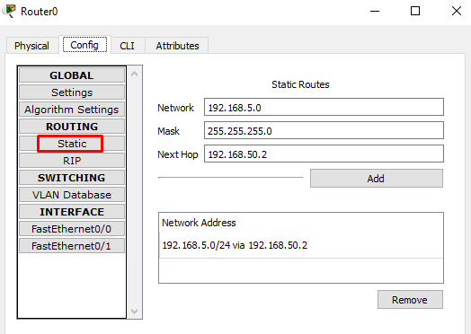
*fig. Static Routes for Router0*

**Static Route for Router1** <br>
Network: `192.168.1.0`<br>
Mask: `255.255.255.0`<br>
Next Hop: `192.168.50.1`<br>
And then click `Add`

Now our network is complete. It's time to test and enjoy.

# DNS

Let us check if web server is pinging to PC1 or not. Go to terminal of PC1 and type `ping 192.168.5.3`
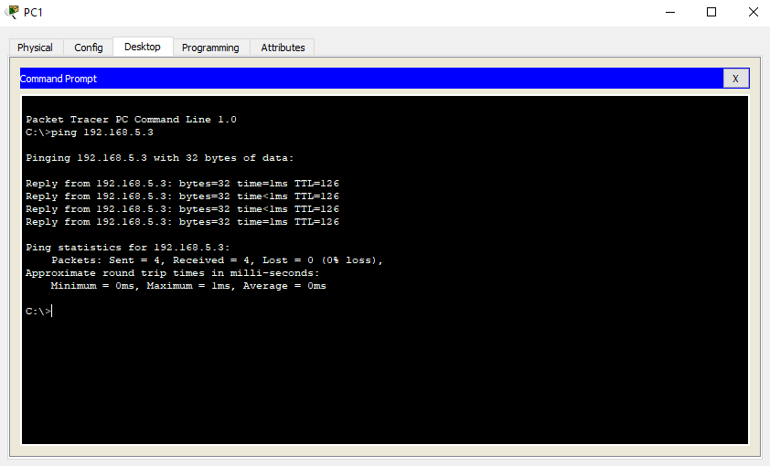
<p align="center"><i>fig. Pinging web server from PC0</i></p>

Let us check the files at web server. When we click `web server` and click `services`, we see that:
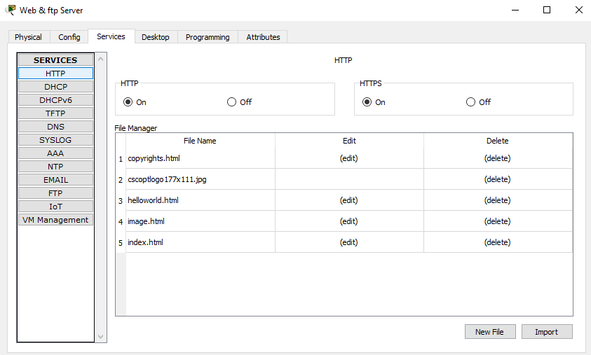
<p align="center"><i>fig. Web Server files</i></p>

Now, browse it from PC0. Click on PC0 and browse `https://192.168.5.3`, you will get the page like following:
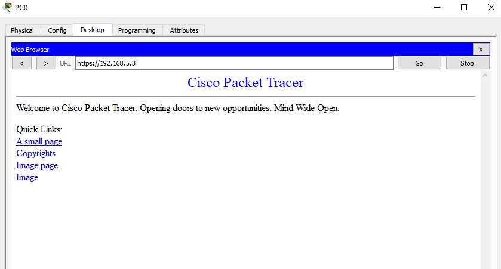
<p align="center"><i>fig. Web browing from PC0 using IP address</i></p>

If we want to browse files using custom domain. We have to configure custom domain to point to web server at DNS server. Here, I am using `www.madhav.com` *(You can use your desired domain)*
To do that follow the steps below:
* Click on `DNS server`
* Click `DNS` from the `services` option
* Turn on `DNS Service`
* On `Resource Records`:- Name: `www.madhav.com`, Type: `A Record`, Address: `192.168.5.3`
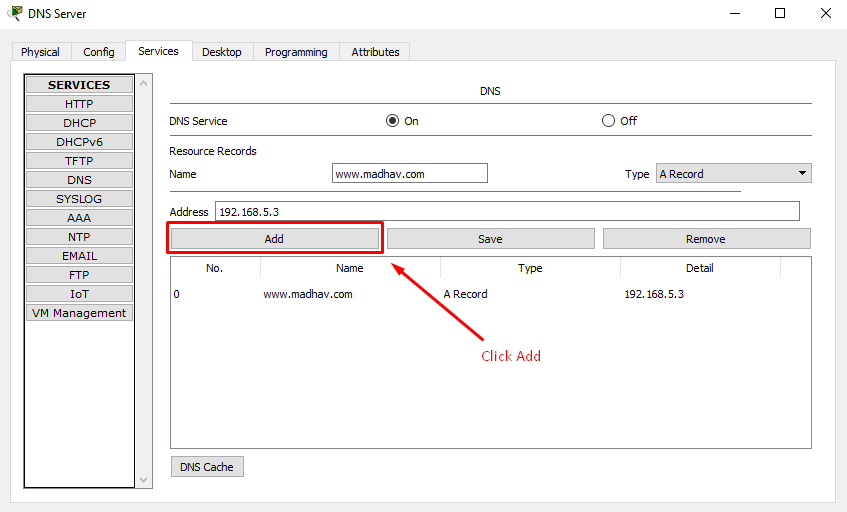
<p align="center"><i>fig. DNS Configuration</i></p>

Now, browse `http://www.madhav.com`, your site is now working.
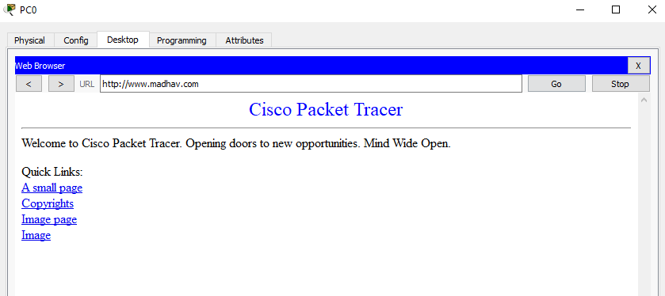
<p align="center"><i>fig. Web browing from PC0 using custom domain</i></p>

# FTP
We have same server for FTP and DNS. To make ftp server, first make sure it is `turned on`. And then we need password to login ftp server. Default username is `cisco` and password is also `cisco`
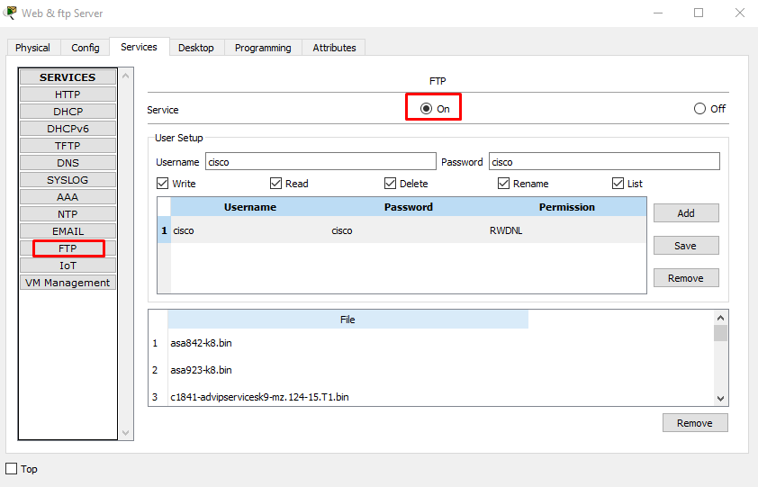
<p align="center"><i>fig. FTP server</i></p>

**FTP GET**

Now, extract the files from ftp server to PC0. Go to terminal of PC0 and login to ftp server:
```
ftp 192.168.5.3
username: cisco
password: cisco
```

*fig. FTP login*

You can get the files of ftp using `get <filename>`

*fig. FTP GET*

**FPT PUT**

This means saving our files from computer to ftp server. We do this by using the command `put <filename>`

First, create a file going to PC0, I named it as `madhav.txt`
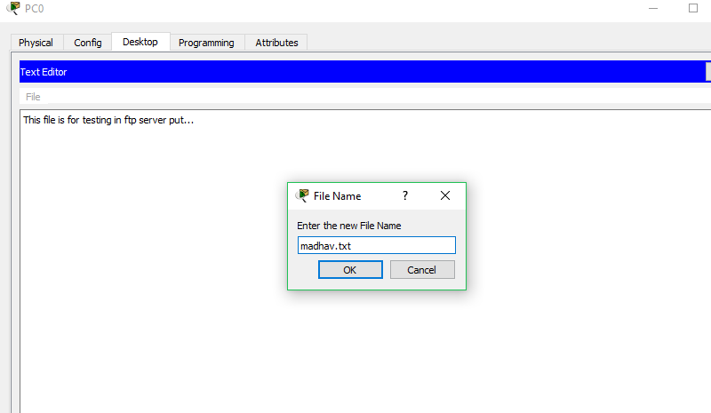
<p align="center"><i>fig. Creating file in PC</i></p>

Finally, put the file to server `put madhav.txt`
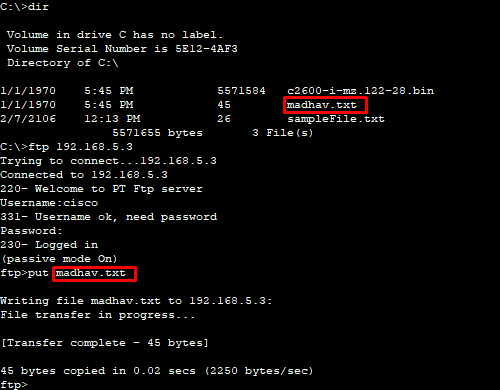
*fig. FTP PUT*
